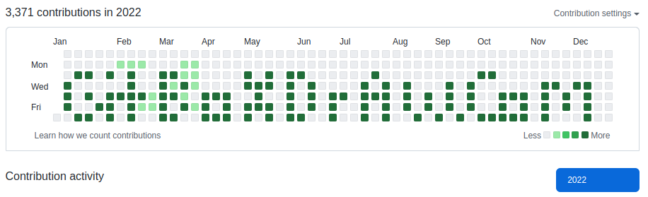

# GitBoxDraw.com

\
\
[GitBoxDraw.com](https://gitboxdraw.com) is a GUI that helps users fill in their desired dates with git commits so that they can display them on their Github or Gitlab profile.
\
\
It works by allowing users to select a desired year and dates with mouse clicks, then
generates a bash script that they can execute to quickly generate the desired commits.
\
\
Users can also use the tool to generate multiple commits for each day, so that those days are shaded using darker color within their Github or Gitlab profiles, which makes their art "pop" relative to their lighter-shaded regular commits.
\
## Example
A live example can be seen on my github profile page at the following link: [https://github.com/sunspla-sh?tab=overview&from=2022-04-01&to=2022-04-09](https://github.com/sunspla-sh?tab=overview&from=2022-04-01&to=2022-04-09)